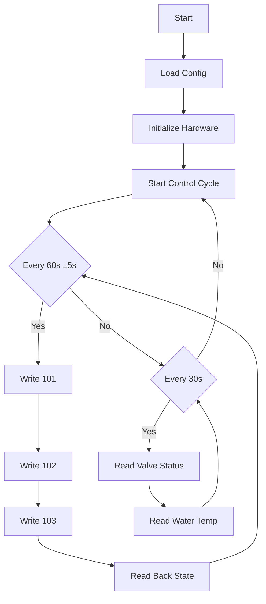

# Technical Documentation

This document provides detailed technical information about the Olimpia Bridge ESPHome component's internals, protocols, and implementation details.

## 🔌 Protocol Details

### Modbus ASCII Implementation
- **Communication Parameters**: 9600 baud, 7 data bits, even parity, 1 stop bit (7E1)
- **Frame Format**:
  ```
  : (start) | Address | Function | Data | LRC | CR LF (end)
  ```
- **LRC Validation**: Two's complement checksum of all bytes (excluding start/end markers)
- **Timing Requirements**:
  - 2ms TX/RX direction switching delay
  - 5ms post-transmit guard time
  - 500ms response timeout
  - 60s control cycle with random jitter (±5s)

### RS-485 Control
- Half-duplex communication using RE/DE pins
- RE (Receive Enable) and DE (Driver Enable) are toggled in sync
- Direction control timing is critical for reliable communication

## 🧮 State Management

### Climate State Storage
1. **Runtime State**
   - Current power state (on/off)
   - Operating mode (auto/heat/cool)
   - Fan speed (auto/min/night/max)
   - Target temperature
   - Current action (idle/heating/cooling)
   - Ambient temperature

2. **Persistent State** (Flash Storage)
   - Last known good configuration
   - Temperature settings
   - Mode preferences
   - Fan speed settings
   - Custom presets
   - Last valid ambient temperature

### Boot Recovery Process
1. Initial boot:
   - Load saved state from flash
   - Read device registers 101 (state) and 102 (temp)
2. State validation:
   - Check for fallback condition (AUTO + 22°C)
   - If detected, restore saved state
3. Recovery actions:
   - Write saved configuration
   - Restore temperature settings
   - Re-enable previous mode/fan settings
4. Verification:
   - Read back registers to confirm
   - Update HA interface accordingly

## 📊 Register Map Details

## 📥 Core Operating Registers

These registers are used frequently during normal operation and are safe for regular read/write operations.

| Register | Description | Access | Format | Notes |
|----------|-------------|---------|---------|-------|
| 1 | Water Temperature | R | °C × 10 | Reported by each slave, optional sensor |
| 9 | Valve Status | R | Bitmap | Bit 13 = ev1, 14 = boiler, 15 = chiller |
| 101 | HVAC Control State | R/W | Bitmap | Controls power, mode, and fan - see below |
| 102 | Target Temperature | R/W | °C × 10 | Desired setpoint temperature |
| 103 | Room Temperature | R/W | °C × 10 | Written from External Home Assistant sensor |

## 🧰 Configuration Registers

These registers should not be written frequently to avoid EEPROM wear. Only use them for configuration tasks.

| Register | Description | Access | Default | Notes |
|----------|-------------|---------|---------|-------|
| 200 | Modbus slave address | R/W | - | Must be unique; avoid overwrites |
| 202 | Minimum allowed setpoint | R/W | 15°C | Temperature limit |
| 203 | Maximum allowed setpoint | R/W | 30°C | Temperature limit |
| 204 | Low Band Hysteresis | R/W | 5 | In tenths of °C |
| 205 | High Band Hysteresis | R/W | 10 | In tenths of °C |
| 210 | Min fan speed (cool) | R/W | 680 | RPM |
| 211 | Min fan speed (heat) | R/W | 680 | RPM |
| 212 | Max fan speed (cool) | R/W | 950 | RPM |
| 213 | Max fan speed (heat) | R/W | 950 | RPM |
| 214 | Max fan speed (min mode) | R/W | 680 | RPM |
| 215 | Max fan speed (night) | R/W | 680 | RPM |
| 216 | Fan with electric heat | R/W | 1400 | RPM |
| 217 | Min water temp (heat) | R/W | 30°C | Regular heating |
| 218 | Min water temp (e-heat) | R/W | 30°C | Electric heating |
| 219 | Max water temp (cool) | R/W | 20°C | Cooling mode |
| 220 | Water temp alarm delay | R/W | 5 | Minutes |
| 233 | Current mode | R | - | 3=heat, 5=cool, 0=auto, 7=fan |

### Control Register (101) Format
```
Bits:  15 14 13 12 11 10  9  8  7  6  5  4  3  2  1  0
      +--+--+--+--+--+--+--+--+--+--+--+--+--+--+--+--+
      |MM|  |CP|           |ST|        |    PRG     |  |
      +--+--+--+--+--+--+--+--+--+--+--+--+--+--+--+--+
      
MM (13-14): Mode
  00 = Auto
  01 = Heat
  10 = Cool
  
CP (12): Contact Presence
  0 = Normal
  1 = Contact Open

ST (7): Standby
  0 = On
  1 = Off

PRG (0-2): Fan Speed
  000 = Auto
  001 = Min
  010 = Night
  011 = Max
```

## 🔄 Control Cycles

### Main Control Loop


### Temperature Management

1. **EMA Filtering**
   ```python
   def apply_ema(new_temp, prev_ema, alpha=0.2):
       if math.isnan(prev_ema):
           return new_temp
       return alpha * new_temp + (1.0 - alpha) * prev_ema
   ```

2. **Update Conditions**
   - First valid reading
   - Significant change (>0.5°C)
   - After 1-hour interval
   - During recovery

3. **Fallback Handling**
   - Store last valid temperature
   - Use on recovery if HA unavailable
   - Reset EMA after 15min inactivity

## 🔐 Error Handling

### Recovery Mechanisms
1. **Communication Errors**
   - 2 retries per request
   - Exponential backoff
   - Error ratio monitoring

2. **State Recovery**
   - Flash storage fallback
   - Boot-time state validation
   - Automatic resynchronization

3. **Temperature Failures**
   - Last known good value
   - EMA reset on timeout
   - Trend validation


